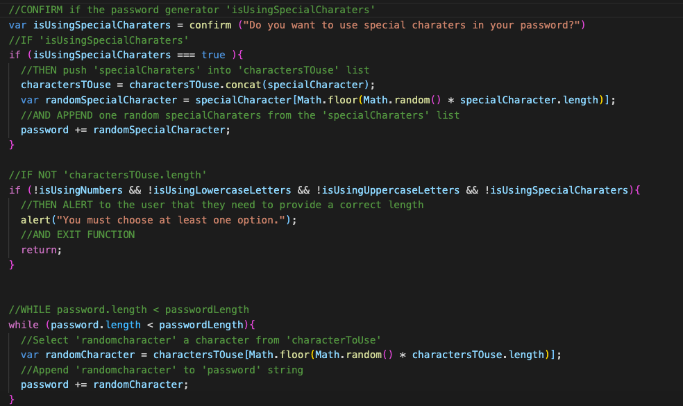
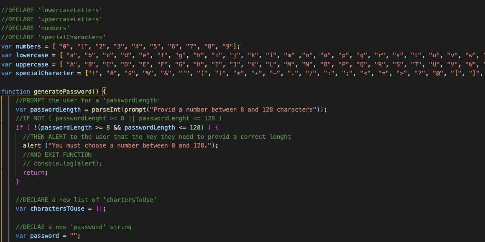
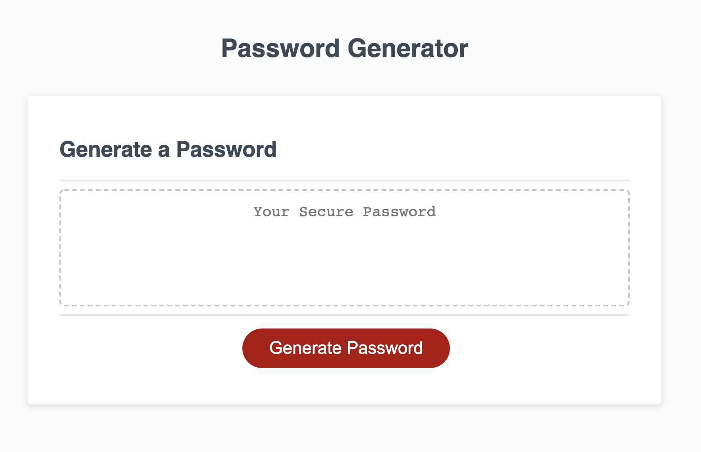

# Secure-Password-Generator

## Description 
A company has asked to make them a random password generator.  This should allow everyone to create their own strong password based off of specific criteria listed below.  The application needs to allow the user to choose the content of the password, and it needs to make sure a base level of that citeria is chosen.

## Link to project 
[Secure-Password-Generator](https://lauragwendolynburch.github.io/Secure-Password-Generator/)

## Sample of JavaScript




## Sample of Project 


## Acceptance Criteria
Code must run and complete all of these steps

```
GIVEN I need a new, secure password
WHEN I click the button to generate a password
THEN I am presented with a series of prompts for password criteria
WHEN prompted for password criteria
THEN I select which criteria to include in the password
WHEN prompted for the length of the password
THEN I choose a length of at least 8 characters and no more than 128 characters
WHEN prompted for character types to include in the password
THEN I choose lowercase, uppercase, numeric, and/or special characters
WHEN I answer each prompt
THEN my input should be validated and at least one character type should be selected
WHEN all prompts are answered
THEN a password is generated that matches the selected criteria
WHEN the password is generated
THEN the password is either displayed in an alert or written to the page
```

## User Notes 
This was really possible because of pesudo coding that I was coached on.  It is a first JS project.  I learned a ton. There are still some parts of this project that I do not understand, and yet somehow I made it work.  I hope to be able to come back to this in a few weeks with more clarity.  
